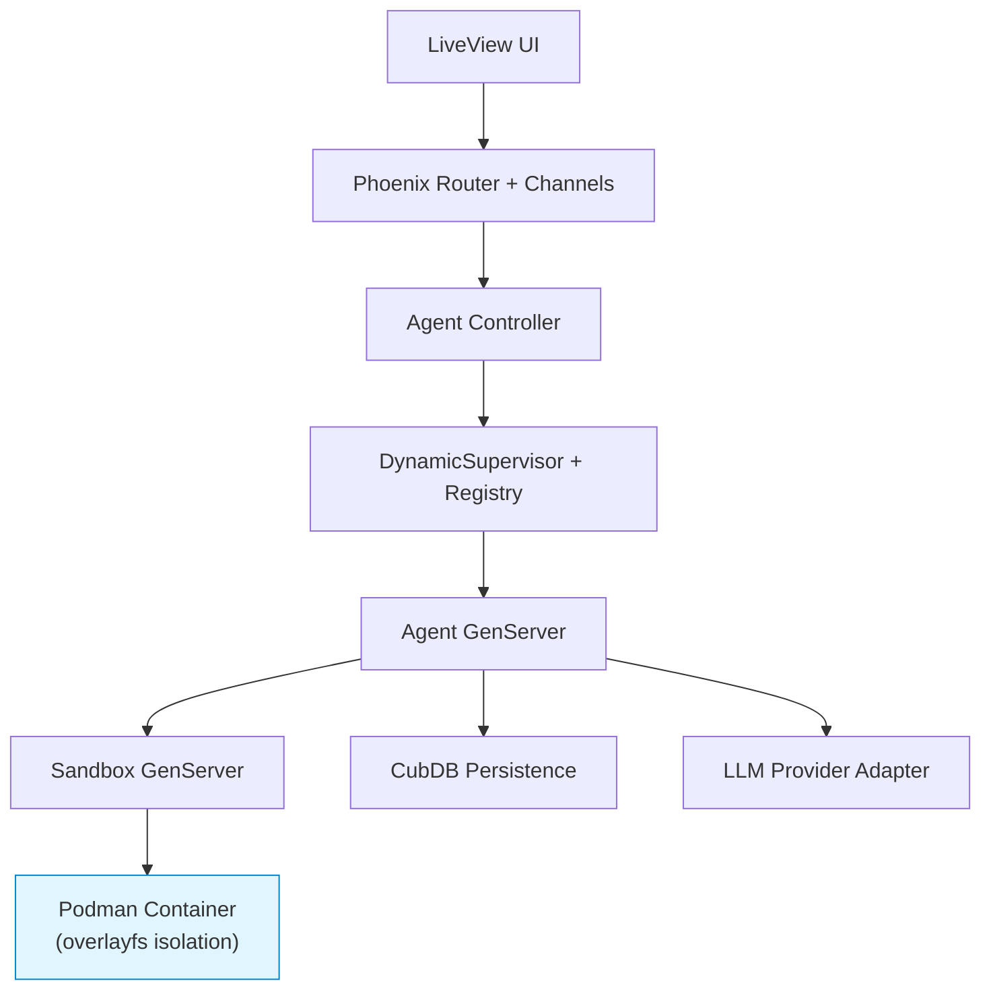

# 🪴 Orchid

[](https://elixir-lang.org)
[](https://github.com/phoenixframework/phoenix_live_view)
[](https://podman.io)

**Secure • Sandboxed • Multi-Agent LLM Orchestration**

Run reliable teams of LLM agents locally with **strong container isolation**, persistent goals, structured object editing, and a beautiful real-time dashboard.

---


*(Replace this placeholder with a real screenshot or 10-second GIF of the dashboard after you record one!)*

## ✨ Features

- **Hard Sandboxing** — Every agent runs in its own Podman container (overlayfs preferred + smart Elixir union-fs fallback)
- **Goal-Driven Workflows** — Persistent goals, planning, execution, self-review, and human approval loops
- **Structured Object Editing** — Agents create/edit rich objects (codebases, documents, data structures, plans) instead of just text
- **Human-in-the-Loop Review Queue** — Built-in approval system for critical or high-stakes actions
- **Real-time LiveView Dashboard** — Monitor, intervene, and collaborate with all agents live
- **Developer-First CLI** — `./orchid start`, `stop`, `logs`, `status`, `shell <agent>`
- **Local & Private** — Everything runs on your machine. Full control, zero data leaves your laptop

## 🚀 Quick Start (under 60 seconds)

```bash
git clone https://github.com/sdancer/orchid.git && cd orchid

mix deps.get

# Configure your LLM keys
cp .env.example .env # ← edit this file

./orchid start
```

Open <http://localhost:4000> — you're ready to create your first agent!

### Requirements

- Elixir 1.17+ & Erlang/OTP 26+
- Podman (v4+, rootless mode strongly recommended)
- An LLM provider (Ollama, OpenAI, Anthropic, Groq, etc.)

> **Pro tip:** Rootless Podman + overlayfs gives the best security and performance.

## 🏗 Architecture



Built on battle-tested OTP patterns:

- **DynamicSupervisor + Registry** for agent lifecycle
- **CubDB** for lightweight embedded storage
- **Bandit + Phoenix LiveView** for the web layer

## 🔒 Security Model

See [`SANDBOX.md`](SANDBOX.md) for full details.

Every agent is isolated in its own container with:

- Filesystem overlay isolation
- Minimal privileges & resource limits (configurable)
- Optional network restrictions
- Graceful fallback to union-fs when full Podman isn't available

## 📍 Status & Roadmap

**Early Alpha** (57 commits, heavily assisted by Claude). Expect rapid evolution.

Coming soon:

- Docker Compose support
- Built-in agent templates (Coder, Researcher, Critic, etc.)
- Usage & cost tracking
- Simple auth for the web UI
- Hex package + full documentation

## 🤝 Contributing

We love contributions! See `CONTRIBUTING.md` (coming soon) and [`CLAUDE.md`](CLAUDE.md) for our development philosophy.

## 📄 License

[MIT License](LICENSE) — free to use, modify, and build upon for both personal and commercial projects.

---

Made with ❤️ and OTP for the Elixir and AI communities.
